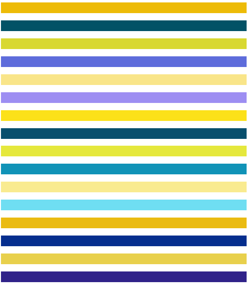

# randomcolor-cpp

A port of [https://github.com/davidmerfield/randomColor](https://github.com/davidmerfield/randomColor "randomColor") ([8f970a](https://github.com/davidmerfield/randomColor/commit/8f970af503124a3430f0016974be2ed1478ee63d)) to C++.

Tested on VC++ 2013.

Color blind test using tools from [http://colororacle.org/ 
](http://colororacle.org/ )


# Usage

see `sample.cpp`


```c++

    #include "randomcolor.h"
    #include <iostream>
    #include <fstream>
    #include <time.h> /* time */
    #include <functional>
    
    auto ColorGeneratorDeuteranopia = [=]() -> std::function<std::tuple<int, int, int>()> {
        srand((int) time(NULL));
        RandomColor::Options o;
        o.hue        = 0;
        o.hue_name   = RandomColor::UNSET;
        o.seed       = rand() % 1000;
        auto RG      = RandomColor::RandomColorGenerator(o);
        int  j       = 3;
        int  i       = 1;
        return [i, j, RG]() mutable {
            bool flag_done = false;
            while (!flag_done) {
                i++;
                if (i > 8) {
                    i = 2;
                    j++;
                    if (j > 3) {
                        j = 1;
                    }
                }
                flag_done       = true;
                auto color_name = static_cast<RandomColor::HUENAMES>(i);
                if (color_name == RandomColor::HUENAMES::RED || color_name == RandomColor::HUENAMES::ORANGE || color_name == RandomColor::HUENAMES::GREEN || color_name == RandomColor::HUENAMES::PURPLE || color_name == RandomColor::HUENAMES::PINK) {
                    flag_done = false;
                }
                RG.options.luminosity = static_cast<RandomColor::LUMINOSITY>(j);
                RG.options.hue_name   = static_cast<RandomColor::HUENAMES>(i);
            }
            return RG.randomColorRGB();
        };
    };
    
    auto ColorGeneratorNormal = [=]() -> std::function<std::tuple<int, int, int>()> {
        srand((int)time(NULL));
        RandomColor::Options o;
        o.hue = 0;
        o.hue_name = RandomColor::UNSET;
        o.seed = rand() % 1000;
        auto RG = RandomColor::RandomColorGenerator(o);
        int  j = 3;
        int  i = 1;
        return [i, j, RG]() mutable {
            bool flag_done = false;
            while (!flag_done) {
                i++;
                if (i > 8) {
                    i = 2;
                    j++;
                    if (j > 3) {
                        j = 1;
                    }
                }
                flag_done = true;
                auto color_name = static_cast<RandomColor::HUENAMES>(i);
                RG.options.luminosity = static_cast<RandomColor::LUMINOSITY>(j);
                RG.options.hue_name = static_cast<RandomColor::HUENAMES>(i);
            }
            return RG.randomColorRGB();
        };
    };
    
    
    int main(int argc, char * argv[]) {
        std::ofstream myfile;
        myfile.open("example.html");
        auto G = ColorGeneratorNormal();
        for (int i = 0; i < 20; i++) {
            std::tuple<int, int, int> r = G();
            std::cout
                << std::get<0>(r) << "," << std::get<1>(r) << "," << std::get<2>(r) << std::endl;
            myfile << R"(
            <h2 style = 'color:rgba(0,0,0,0);background-color:rgb()"
                   << std::get<0>(r) << "," << std::get<1>(r) << "," << std::get<2>(r) << R"()'>
                    .
                </h2>
            )";
        }
        myfile.close();
    }


```

## Usage for wxWidgets framework

```c++

    wxColor RandomColor() {
        auto r = ColorGeneratorNormal();
        return wxColor(std::get<0>(r), std::get<1>(r), std::get<2>(r));
    }

```

# Examples

## Normal


## Deuteranopia Friendly




# Limitations

Only generates RGB format color